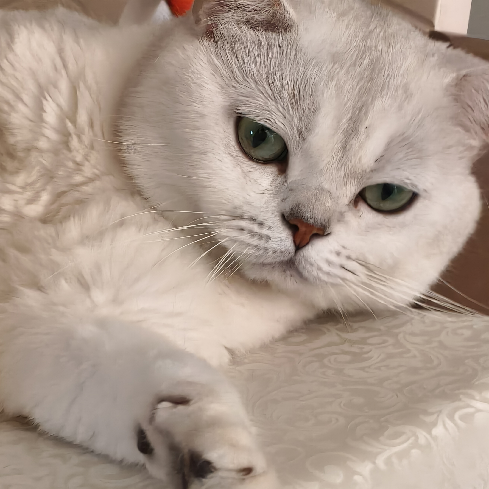

::: {.hero}

::: {.profile-row}

{.profile-photo}

::: {.profile-text}

# Yiming Chen 陈一鸣

I am interested in minimal surfaces, geometric analysis, and min-max theory. This site is a place for mathematical notes, reading records, expository articles, and selected lecture/project materials.

欢迎关注我的小红书 @鲨落！  

<-- 左边是我家的猫“小咪”，他是一只英短银渐层猫。

:::

:::

:::

### Education

2022.9--2026.6: B.S. in Mathematics, Wuhan University, China.  
2026.9--: Ph.D. student in Mathematics, Fudan University / Shanghai Center for Mathematical Sciences, China.

::: {.card-grid}
::: {.card}
### [Writing](writing.qmd)

Short mathematical articles and reading notes, mostly on minimal surfaces and geometric analysis.
:::

::: {.card}
### [CV](cv.qmd)

A compact academic profile: education, interests, talks, notes, and contact information.
:::

::: {.card}
### [Projects & Notes](projects.qmd)

Lecture notes, seminar notes, problem collections, and downloadable materials.
:::
:::

## Current interests

- Minimal hypersurfaces and min-max theory.
- Almgren--Pitts theory and Simon--Smith type constructions.
- Stability, Morse index, and geometric variational problems.
- Interactions between Ricci flow, scalar curvature, and minimal surfaces.

## Recent writing

See the [Writing](writing.qmd) page for all posts.